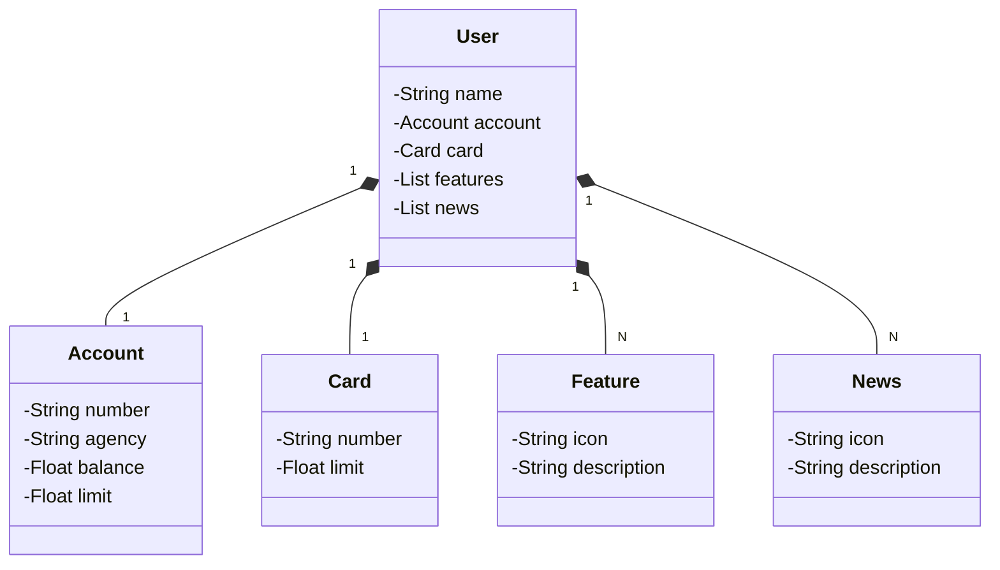

# Santander Dev Week 2023
Java RESTful API criada para a Santander Dev Week

## Estrutura do JSON
```
{
  "name": "tharlis",
  "account": {
    "number": "00000-0",
    "agency": "0000",
    "balance": 1234.64,
    "limit": 1000.00
  },
  "features":[
    {
      "icon": "URL",
      "description": "Descrição da Feature"
    }
  ],
  "card": {
    "number": "xxxx-xxxx-xxxx-xxxx",
    "limit": 1000.00
  },
  "news": [
    {
      "icon": "URL",
      "description": "Descrição da novidade"
    }
  ]
}
```

## Diagrama de Classes para o Modelo de Usuário Bancário



Este diagrama de classes representa a estrutura de dados de um usuário de um banco, com base no JSON.

## Descrição do Modelo

### Classes

- **User**: Representa o usuário do banco. Contém informações básicas sobre o usuário, como o nome, além de objetos que representam a conta bancária, o cartão de crédito, as funcionalidades disponíveis para o usuário e as novidades associadas.

- **Account**: Representa a conta bancária do usuário. Contém informações como número da conta, agência, saldo e limite de crédito.

- **Card**: Representa o cartão de crédito do usuário, com o número do cartão e o limite de crédito associado.

- **Feature**: Representa as funcionalidades ou recursos associados ao usuário, com informações sobre um ícone e uma descrição.

- **News**: Representa as novidades ou atualizações para o usuário, com informações sobre um ícone e uma descrição.

### Relacionamentos

- **User** tem uma **Account** e um **Card**.
- **User** pode ter várias **Feature** e várias **News**.
